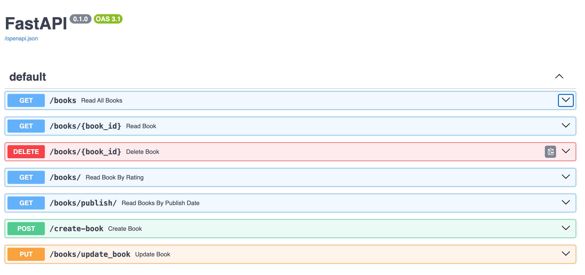

# Building a Simple Book REST API with Python 3

This project demonstrates how to build a simple REST API for managing books using **FastAPI** and **Uvicorn**.

# Setup instructions

## 1. Setup a Virtual Environment in Python

Before installing dependencies, create and activate a virtual environment.

Follow the instructions:
```bash
python3 -m venv fastapienv
source fastapienv/bin/activate

## 2. Install dependencies

Inside the project, run the following CLI commands.
    1. pip3 install fastapi

    2. pip3 install "uvicorn[standard]"

## 3. Run the project

The command for books_v1 is `uvicorn books_v1:app`

The command for books_v2 is `uvicorn books_v2:app`

You can now view the project at http://127.0.0.1:8000 

(OR)

You can now view the project at http://127.0.0.1:8000/docs


### 📸 API Response Screenshot


